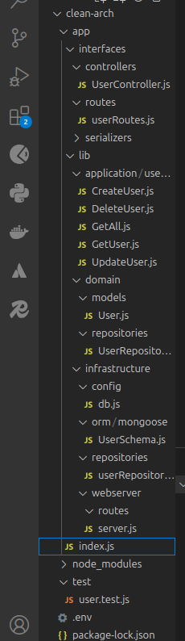

# 🚀 Node.js Clean Architecture App  

A backend application following the **Clean Architecture** principles, built using **Node.js, Express, and MongoDB**.

---

## 📌 Project Structure  

This project is designed following **Clean Architecture**, ensuring separation of concerns:

📂 **Layers:**
- **`domain/`** → Business logic & entities  
- **`application/`** → Use cases (services)  
- **`interfaces/`** → Controllers & routes  
- **`infrastructure/`** → Database & external services  

---

## 📂 Folder Structure  


---

## 📸 Project Structure Image  




---

## 🛠 Installation & Setup  

### 1️⃣ Clone the Repository  
```sh
git clone https://github.com/ake144/nodejs-clean-architecture-app.git
cd nodejs-clean-architecture-app
